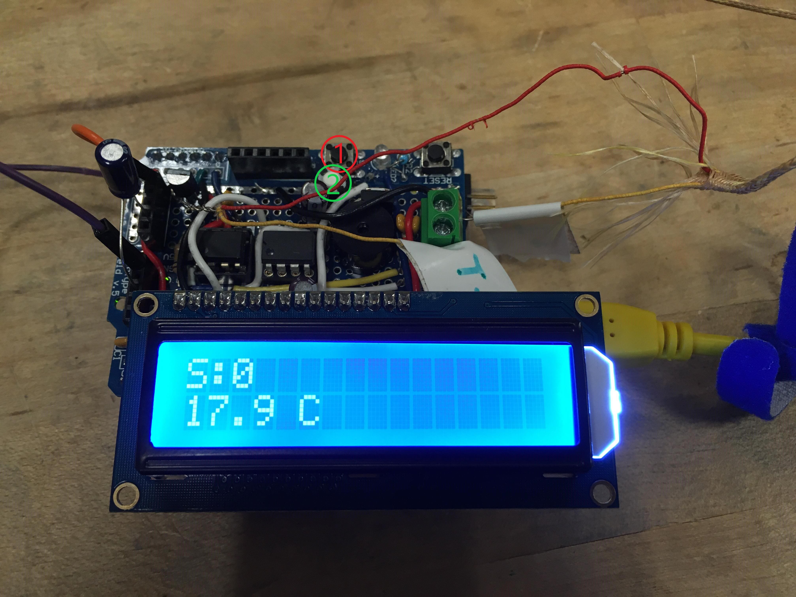
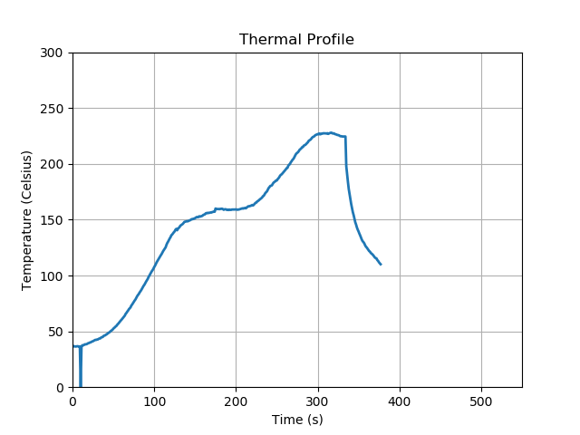

# Reflow Oven Controller

A project for controlling a toaster oven to be able to reflow solder for PCB assembly using Arduino and Python.

## Context

This was designed from a previous iteration of our reflow oven controller, redesigning it in Arduino to be maintainable. Our current setup is a perfboard arduino shield, where this repository stores the code for the project, PCB design and schematics, and Thermal profile graphs when reflowing PCB's using python to do the graphing.

The current system is shown below:

Legend: 1 - Start Button   2 - Abort Button

One test graph is shown below, created with python:

## Required Software

- Arduino IDE or External Code Editor (I use VS Code to flash the Arduino)
- Python 3.6.7 (I like using [WinPython](http://winpython.github.io/))

## How to use the Controller

#### Step 1: Connections
- Plug in the negative and positive terminals for the thermocouple, marked on both the wire and the terminal connector
- Plug in the CTRL/GND/5V connection to the header, keeping in mind the orientation (Yellow/Black/Red)

#### Step 2: Arduino IDE
- Install the Arduino IDE (or use VS Code), in case the code needs to be re-flashed onto the controller
- Plug in the USB Blaster cable to the Arduino, and check if you see the display on the LCD
- Re-flash the code if you aren't sure

#### Step 3: Run the Python Script
- Python prompts for using preset values or to change them
- Next python prompts to press the START button (shown in layout above)
- Python starts graphing temperature vs time
- The Arduino will abort the process automatically if the temperature does not rise fast enough (i.e. the thermocouple fell out of the oven)
- The process can be aborted by using the abort button (also shown above)
- The process will start the cooling cycle early if the temperature goes above 240 C (things will start to burn at 230 C keep in mind)

#### Step 5: Be patient and wait
- The controller will beep at you every time it changes state
- It will also give you a long beep when it is time to open the oven for cooling
- 6 beeps at the end means it is cool enough inside the oven for you to touch the PCB (usually)

#### Step 6: You're Done!!!!

